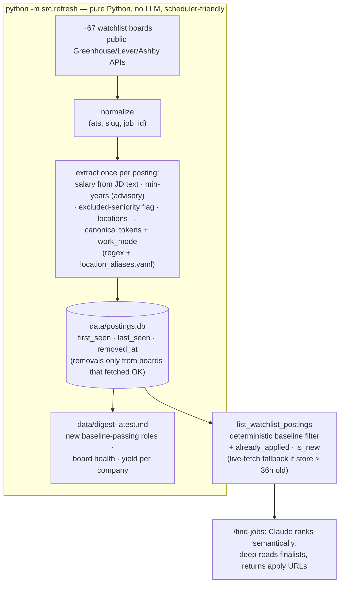
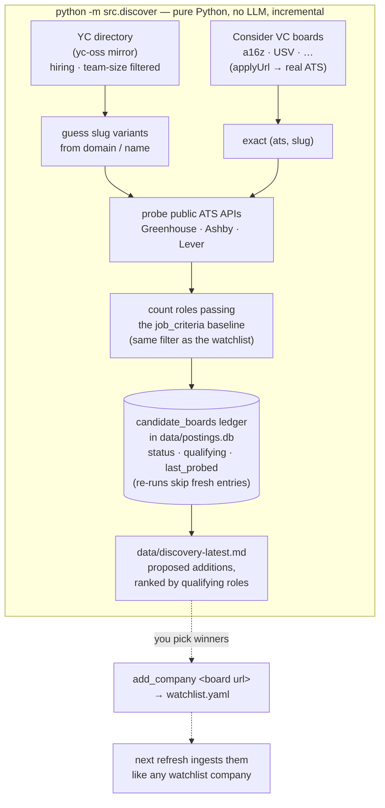
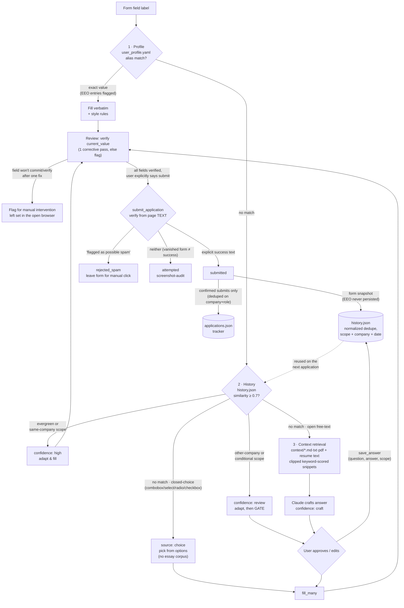
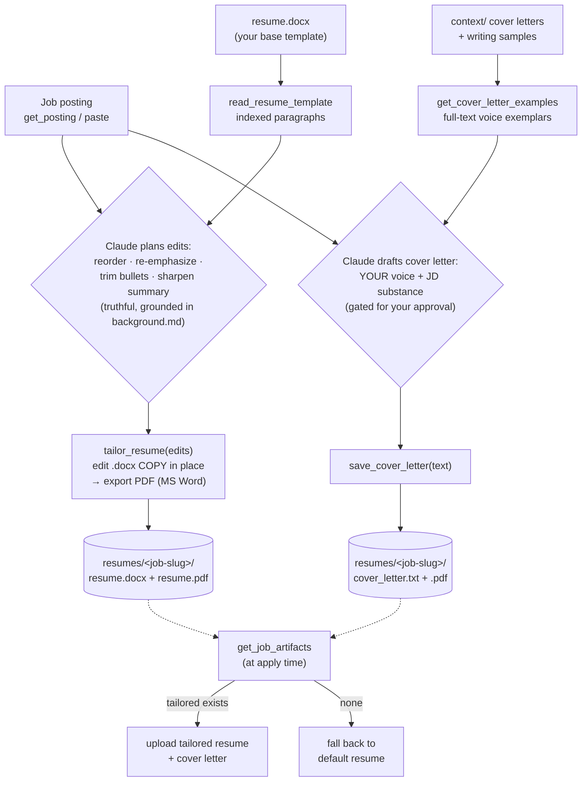
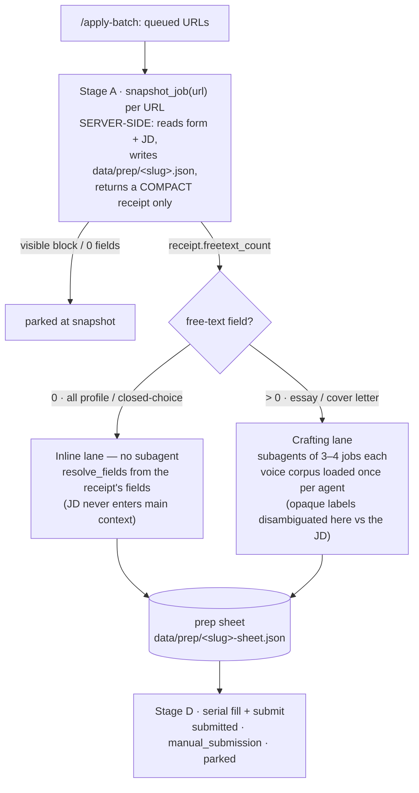
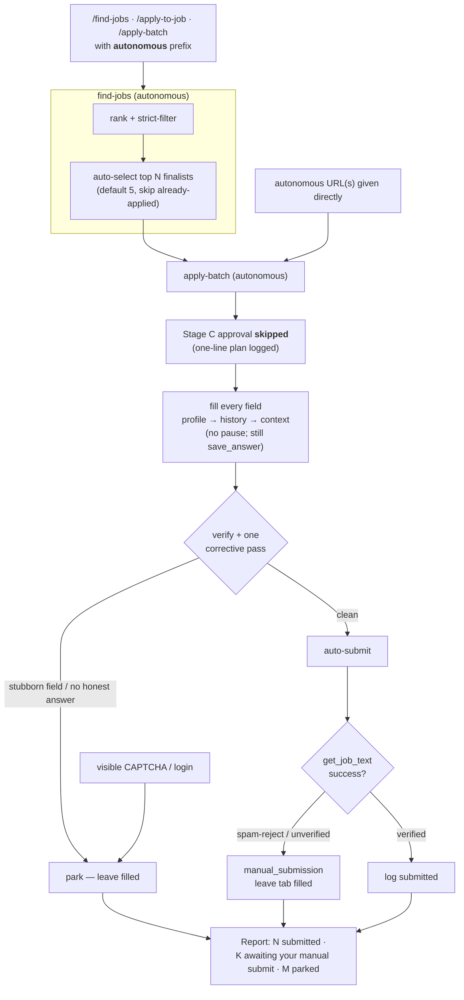
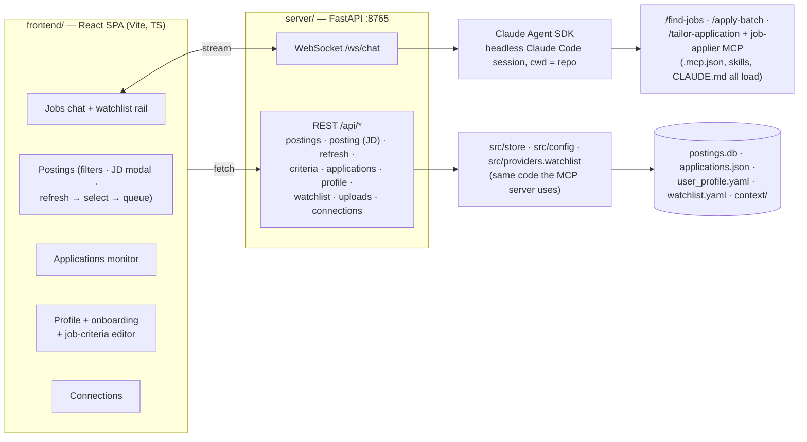

# Job Applier

An AI job-application agent that runs inside **Claude Code**. It finds high-quality
product/strategy roles across a curated company watchlist and fills out their
application forms on any ATS (Greenhouse, Lever, Ashby, Workday…) — intelligently,
and **never submitting without your say-so**.

Claude Code is the reasoner; a local **MCP server** gives it a real browser
(Playwright), your profile/history/knowledge base, and live jobs from company
career boards. **No LLM API key or cost** in the core flow.

## Quick start

```bash
pip install -r requirements.txt
playwright install chromium
```

Open this project in Claude Code and reload it (loads `.mcp.json`), then:

- `/find-jobs fintech product strategy` — search your watchlist, ranked & filtered.
- `/apply-to-job <url>` — open an application and fill it from your data.
- `/apply-batch <url> <url> …` — queue several applications: answers are
  prepared in parallel, you approve everything (including per-job submit
  consent) in **one** upfront review, then the queue fills and submits
  serially with zero further prompts — anything unexpected is parked with a
  reason instead of interrupting you.
- `/tailor-application <url>` — **on demand**, generate a bespoke resume +
  cover letter for one posting: it re-emphasizes/reorders bullets in your
  `resume.docx` (formatting preserved) and drafts a cover letter in **your own
  writing voice**, saved for the apply flow to pick up automatically.
- **`autonomous` prefix** — prefix the argument of `/find-jobs`,
  `/apply-to-job`, or `/apply-batch` with `autonomous` (e.g.
  `/apply-batch autonomous <url> <url>`) to run **without approval gates** and
  **auto-submit where possible**. Jobs that still need a manual submit
  (spam-reject, visible CAPTCHA, parked fields) are left filled for you. Opt-in
  per run — nothing is ever autonomous unless you say so. See
  [the autonomous flow](#autonomous-mode-hands-off-per-run) below.

Edit `user_profile.yaml`, `job_criteria.yaml`, `watchlist.yaml`, `resume.txt`
(+ optional `resume.pdf`), and `context/` to make it yours.

Optionally, keep the job corpus warm without a Claude session:

```bash
python -m src.refresh    # fetch all boards → data/postings.db + data/digest-latest.md
```

> **⚠️ EEO / self-identification data:** `user_profile.yaml` may contain
> voluntary EEO self-identification values (gender, race/ethnicity,
> Hispanic/Latino status, veteran status, disability status), each marked with
> `eeo: true`. This is sensitive demographic data: it lives in plain text in
> this repo, and when present the agent will auto-answer the corresponding
> *voluntary* self-ID sections on applications. Providing it is always
> optional — delete the values to have those sections left blank instead. EEO
> answers are never written to the answer history or the application log.

## How jobs are discovered

Discovery is split into a **deterministic, LLM-free ingest** (schedulable — it
needs no Claude session) and a **semantic ranking layer** that Claude runs at
`/find-jobs` time over the local store. Salary, years-of-experience, and
seniority are extracted **once per posting at ingest**, so the strict baseline
in `job_criteria.yaml` is enforced as a local query instead of per-search JD
deep-reads.



The store is a cache of public data — delete `data/postings.db` and the next
refresh rebuilds it. Schedule the refresh daily (Windows Task Scheduler via
`scripts/refresh.cmd`, or cron/launchd) to get a standing digest of new
matching roles; see the USER_GUIDE.

## Growing the watchlist automatically

The watchlist is curated and hand-approved, but you don't have to find the
companies by hand. `python -m src.discover` (also LLM-free, config in
`discovery.yaml`) enumerates candidate startups from **company-list feeds** —
the **YC company directory** and **VC portfolio job boards** (a16z, USV, … any
board powered by Consider) — and **confirms each against the public ATS APIs**,
counting how many of its roles pass your `job_criteria.yaml` baseline. The
search-engine path that used to rate-limit us is gone: Consider boards hand back
each company's real ATS slug directly, and YC companies are resolved by probing
slug guesses against the same Greenhouse/Ashby/Lever endpoints the refresh
already hits.



Every run probes up to `max_probes_per_run` candidates (exact Consider slugs
first, then YC guess-probes) and queues the rest, so the cost is bounded and
re-runs only touch new or stale boards. Nothing lands on the watchlist without
your say-so — the report proposes, you `add_company` the ones you want. Full
walkthrough in the USER_GUIDE.

## How a field gets answered

Every form field runs through a strict source cascade — **profile → history →
context** — where the first hit wins and precision decreases (and gating
increases) down the stack. Approved and submitted answers flow back into
history, so the system compounds with every application.



- **Profile** (deterministic): ~30 curated facts matched by alias phrases;
  filled verbatim, never re-stored. EEO self-ID values are flagged and only
  used in voluntary self-ID sections.
- **History** (probabilistic, vetted): your own past answers, fuzzy-matched
  and scope-gated — only evergreen or same-company matches auto-fill;
  everything else needs approval.
- **Context + resume** (generative, always gated): paragraph chunks scored by
  keyword overlap; Claude writes from the snippets and pauses for approval.
  The resume text is just another retrieval source here — it has no special
  priority over `context/` files.

## Tailoring a resume + cover letter (on demand)

Response rate — not just apply speed — is the highest-leverage lever, so
`/tailor-application <url>` produces a **bespoke resume and cover letter for one
posting**. It is explicitly invoked, never part of the normal apply flow, and
follows the same "Claude reasons, tools are hands" split: Python reads the base
`.docx`, applies the edits Claude decides, exports the PDF, and gathers your own
past cover letters as voice exemplars — **no LLM API key**.



The job folder is keyed off the **same `(company, role)` identity**
`applications.json` dedupes on, so `/apply-to-job` and `/apply-batch`
automatically use the tailored artifacts when they exist and the default resume
otherwise. Drop a `resume.docx` in the project root to enable resume tailoring
(the cover-letter half works from `context/` alone). PDF export is
cross-platform: it uses Microsoft Word when present (Windows or macOS) and
falls back to LibreOffice (`soffice`, any OS, no Word needed); if neither is
installed the tailored `.docx` is still saved to export manually.

## Batch prep — snapshot & routing (how `/apply-batch` stays cheap)

`/apply-batch` is engineered so the per-application token cost stays low even
across a large queue. Two ideas do the work: **snapshot server-side** (the big
form dumps and job descriptions are written straight to disk and never pass
through a model's context), and **route by `freetext_count`** (jobs with no
open-ended field are resolved *inline* with no subagent; only genuine
essay/cover-letter jobs pay for a crafting agent, and those are grouped so the
voice corpus loads once per agent).



The receipt's `freetext_count` is derived from a `multiline` flag the form
scanner sets on textareas / contenteditable / ARIA textboxes, so the router
never has to read a field payload to decide the lane.

## Autonomous mode (hands-off, per run)

By default the agent gates its answers and **never submits without your say-so**.
Prefix any of the three commands' arguments with **`autonomous`** to opt that one
run into full hands-off execution: it resolves and fills every answer without
pausing, and **auto-submits where it safely can**. In autonomous `/find-jobs` it
also **auto-selects the top finalists** (default 5, skipping already-applied) and
chains straight into the batch apply — search to submit, end to end.

Autonomous mode removes the **approval gates**, not the **guardrails**. It still
won't fight a stubborn widget (one corrective pass, then park), won't
force-submit past a spam-reject or a visible CAPTCHA, and never fabricates an
answer — anything it can't complete cleanly is left **fully filled** in its tab
for a one-click manual submit, exactly as in gated batch mode.



## Web wrapper — Applyer (optional frontend)

The whole agent also has a **desktop web face**: a React SPA (`frontend/`) +
FastAPI backend (`server/`) that wraps the same data files and skills. The
chat surface spawns **real Claude Code sessions in this repo via the Claude
Agent SDK** (your existing Claude Code auth — still no API key), so
`/find-jobs`, `/apply-batch`, and `/tailor-application` run for real, with
tool calls streaming into live run cards. The other surfaces are served from
the same modules the MCP server uses, so they always match what the agent
sees.

```bash
pip install -r requirements.txt        # now includes fastapi/uvicorn/claude-agent-sdk
cd frontend && npm install && npm run build && cd ..
scripts\webapp.cmd                     # serves http://localhost:8765 and opens it
```



The Postings page filters roles by title, location (normalized tokens — "SF"
and "San Francisco, CA" match together), YoE/salary ranges, and posted date;
a chevron opens the full JD in a modal, and a **Refresh** button runs the same
board sweep as `python -m src.refresh` right from the UI. Selecting postings
and confirming the apply modal launches a **real** `/apply-batch` (the
autonomous variant shows an explicit warning modal first). Write-back from the
UI is deliberately narrow: watchlist add (same logic as `add_company`),
whitelisted profile string facts (comment-preserving edits to
`user_profile.yaml`; EEO entries are never shown or written), the job-criteria
card on Profile (comment-preserving edits to `job_criteria.yaml`), and resume /
context uploads. Connections is status-only — authorization still happens in
Claude Code.

**Full setup and usage: [USER_GUIDE.md](USER_GUIDE.md).**
