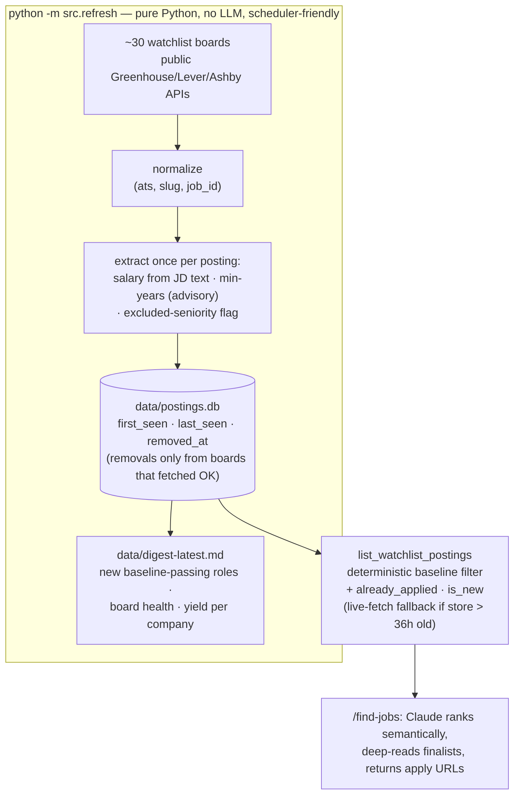
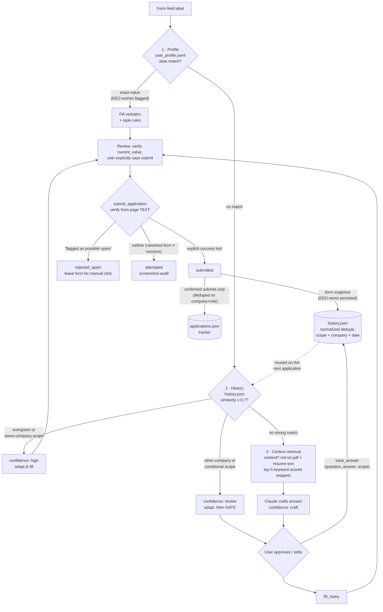

# Job Applier

An AI job-application agent that runs inside **Claude Code**. It finds high-quality
product/strategy roles across a curated company watchlist and fills out their
application forms on any ATS (Greenhouse, Lever, Ashby, Workday…) — intelligently,
and **never submitting without your say-so**.

Claude Code is the reasoner; a local **MCP server** gives it a real browser
(Playwright), your profile/history/knowledge base, and live jobs from company
career boards. **No LLM API key or cost** in the core flow.

## Quick start

```bash
pip install -r requirements.txt
playwright install chromium
```

Open this project in Claude Code and reload it (loads `.mcp.json`), then:

- `/find-jobs fintech product strategy` — search your watchlist, ranked & filtered.
- `/apply-to-job <url>` — open an application and fill it from your data.
- `/apply-batch <url> <url> …` — queue several applications: answers are
  prepared in parallel, you approve everything (including per-job submit
  consent) in **one** upfront review, then the queue fills and submits
  serially with zero further prompts — anything unexpected is parked with a
  reason instead of interrupting you.

Edit `user_profile.yaml`, `job_criteria.yaml`, `watchlist.yaml`, `resume.txt`
(+ optional `resume.pdf`), and `context/` to make it yours.

Optionally, keep the job corpus warm without a Claude session:

```bash
python -m src.refresh    # fetch all boards → data/postings.db + data/digest-latest.md
```

> **⚠️ EEO / self-identification data:** `user_profile.yaml` may contain
> voluntary EEO self-identification values (gender, race/ethnicity,
> Hispanic/Latino status, veteran status, disability status), each marked with
> `eeo: true`. This is sensitive demographic data: it lives in plain text in
> this repo, and when present the agent will auto-answer the corresponding
> *voluntary* self-ID sections on applications. Providing it is always
> optional — delete the values to have those sections left blank instead. EEO
> answers are never written to the answer history or the application log.

## How jobs are discovered

Discovery is split into a **deterministic, LLM-free ingest** (schedulable — it
needs no Claude session) and a **semantic ranking layer** that Claude runs at
`/find-jobs` time over the local store. Salary, years-of-experience, and
seniority are extracted **once per posting at ingest**, so the strict baseline
in `job_criteria.yaml` is enforced as a local query instead of per-search JD
deep-reads.



The store is a cache of public data — delete `data/postings.db` and the next
refresh rebuilds it. Schedule the refresh daily (Windows Task Scheduler via
`scripts/refresh.cmd`, or cron/launchd) to get a standing digest of new
matching roles; see the USER_GUIDE.

## How a field gets answered

Every form field runs through a strict source cascade — **profile → history →
context** — where the first hit wins and precision decreases (and gating
increases) down the stack. Approved and submitted answers flow back into
history, so the system compounds with every application.



- **Profile** (deterministic): ~30 curated facts matched by alias phrases;
  filled verbatim, never re-stored. EEO self-ID values are flagged and only
  used in voluntary self-ID sections.
- **History** (probabilistic, vetted): your own past answers, fuzzy-matched
  and scope-gated — only evergreen or same-company matches auto-fill;
  everything else needs approval.
- **Context + resume** (generative, always gated): paragraph chunks scored by
  keyword overlap; Claude writes from the snippets and pauses for approval.
  The resume text is just another retrieval source here — it has no special
  priority over `context/` files.

**Full setup and usage: [USER_GUIDE.md](USER_GUIDE.md).**
